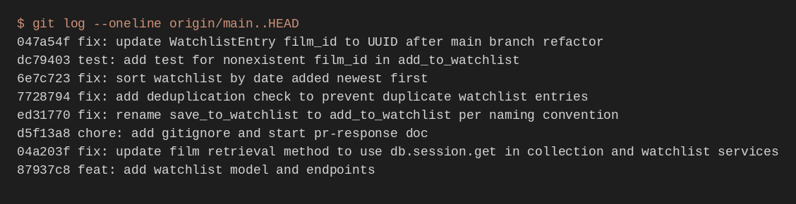

# PR Response Doc — CineLog Watchlist Feature

## AI Usage

I used AI tools mainly for orientation and for stress-testing the two design writeups:

1. **Codebase orientation** — I asked for a walkthrough of `add_to_collection()` (existence check → duplicate check → insert) before writing watchlist dedup myself, then compared that summary against the real function. The return-on-duplicate behavior matched the code (`AlreadyInCollectionError`), so I mirrored it with `AlreadyInWatchlistError`.
2. **Comment 4 / 5 devil's advocate** — After drafting my visibility and sort-order positions, I asked what a careful reviewer would push back on. For visibility, that surfaced "public defaults punish users who treat watchlists as private queues" — I already had a privacy tradeoff paragraph, but I tightened it to spell out that an accidental public save is recoverable while a private default quietly kills discovery. For sort order, the counter was "A–Z is better for finding a known title in a large list" — I kept newest-first as the default but explicitly called alphabetical a reasonable future secondary sort.
3. **Commit hygiene check** — After rewriting history, I asked whether each `git log --oneline` message was one logical change in conventional format; I kept them as separate fix/test/feat/docs commits instead of bundling.

I did not ask AI to invent the product decisions — the `public=True` default and date-added sort are my calls, grounded in how CineLog users actually use queues vs. collections.

## Comment 1 — Rename
**What I did:**
Renamed `save_to_watchlist()` to `add_to_watchlist()` in `services/watchlist_service.py` so it matches the project's `verb_to_noun` naming convention (same pattern as `add_to_collection()`). Updated the import and call site in `routes/watchlist/watchlist.py`.

**How I verified:**
I searched the whole repo for `save_to_watchlist` (ripgrep) and confirmed only two hits before the rename: the function definition and the route import/call. After the change, that search returned zero matches in code. I also ran `pytest tests/ -v` to make sure nothing else broke.

## Comment 2 — Deduplication
**What I did:**
Looked at how `add_to_collection()` in `services/collection_service.py` handles duplicates: it queries for an existing `CollectionEntry` with the same `user_id` + `film_id`, and if one exists it raises `AlreadyInCollectionError` instead of inserting again. I followed that exact pattern in `add_to_watchlist()` — check `WatchlistEntry.query.filter_by(user_id=..., film_id=...).first()`, and if a row is found raise a new `AlreadyInWatchlistError`. The watchlist add route now catches that error and returns HTTP 409 (same status the collection route uses for duplicates).

**How I verified:**
Compared the new check side-by-side with `add_to_collection()`'s dedup block. Ran `pytest tests/ -v` after the change to confirm the existing suite still passes. (A dedicated duplicate-edge-case test for watchlist is included as a stretch feature.)

## Comment 3 — Missing test
**What I did:**
Created `tests/test_watchlist.py` with `test_add_to_watchlist_nonexistent_film_raises`. It uses the same fixtures pattern as `tests/test_collection.py` (`app`, `sample_user`) and asserts that calling `add_to_watchlist` with a fake film id raises `FilmNotFoundError` — exactly the case the reviewer asked for.

**How I verified:**
Modeled the test directly on `test_add_to_collection_nonexistent_film_raises` (same fake UUID, same `pytest.raises(FilmNotFoundError)` structure). Ran `pytest tests/test_watchlist.py -v` and then the full suite.

## Comment 4 — Default visibility
**My position:**
Keep `public=True` as the default for new watchlist entries.

**Reasoning:**
CineLog is a community film-tracking app, not a private diary. The value of a watchlist here is partly social: friends browse what someone is planning to watch the same way they browse collections of films already logged. If new saves defaulted to private, most entries would never surface in that discovery loop unless the user remembered to flip a toggle every time — and "to-watch" adds are often quick, low-friction gestures. Defaulting to public matches that gesture and keeps the social layer alive without requiring setup. Users who want a private backlog can still opt out per entry once we expose a visibility control (see stretch), but the common path should favor sharing.

**Tradeoff acknowledged:**
A private default would better protect people who treat their watchlist as a personal queue and don't want others seeing half-formed taste signal (or spoiler-adjacent titles). That safer default is real for privacy-minded users. I'm still choosing public because CineLog's product promise leans community discovery first; the cost of an accidental public entry is recoverable with an edit, while a private-by-default world quietly kills the "what's on your radar?" interaction that makes public lists interesting in the first place.

## Comment 5 — Sort order
**My position:**
Sort watchlists by `date_added` descending (newest first), matching `get_collection()`.

**Reasoning:**
A watchlist is a queue of intent — "I just saved this, I want to pick it up soon." Chronological newest-first is how people revisit that queue in practice: recent saves are the ones still warm, older ones drift into backlog. Alphabetical title sort forces you to scan for the movie you remember saving yesterday instead of finding it at the top. Aligning with collection sort also keeps mental models consistent across both user lists in CineLog.

**Engagement with reviewer's point:**
I agree with the maintainer that most users want to see what they added recently. That's especially true for watchlists: the "added recently" stack is the actionable part of the list, while A–Z is more useful when you're hunting a known title in a large archive. Alphabetical still isn't wrong as a future secondary sort/filter option, but for the default response from `get_watchlist()` I think date-added newest-first is the right call — so I changed the query accordingly.

## Comment 6 — Rebase
**What conflicted:**
After rebasing `feature/watchlist` onto updated `main`, the UUID film-ID refactor from main replaced `models.py`. The watchlist model lived only on the pre-refactor branch tip (`WatchlistEntry.film_id` as an integer FK), so it disappeared from `models.py` while `services/watchlist_service.py` still described `film_id` as an int. That left the watchlist code broken against main's UUID `Film.id`.

**How I resolved it:**
Re-added `WatchlistEntry` on top of main's UUID models, with `film_id` as `db.String(36)` FK to `film.id` (same shape as `CollectionEntry`). Updated the service/route docs to treat `film_id` as a UUID string instead of an int.

**How I verified no conflict remains:**
`git rebase origin/main` completed with a linear history (no merge commits in `git log --oneline`). Ran `pytest tests/ -v` after the UUID update — all collection + watchlist tests pass. Confirmed `models.WatchlistEntry.film_id` is a string UUID column matching `Film.id`.

### Commit history screenshot

`git log --oneline origin/main..HEAD` on `feature/watchlist` (linear history, conventional commits, no merge commits):



## Stretch Features

### `remove_from_watchlist()`
*(filled after implementation)*

### Second watchlist test
*(filled after implementation)*

### Visibility toggle on add
*(filled after implementation)*

## PR Description

### Summary
Adds a **watchlist** so users can save films they plan to watch later (separate from the already-watched collection). Includes add + list endpoints, deduplication, UUID film IDs after rebasing on main, and a nonexistent-film test.

### Design decisions
1. **Default visibility = public (`public=True`)** — CineLog is discovery-oriented; defaulting saves to public keeps watchlists shareable without an extra toggle on every add, while still allowing private entries via an optional `public` body field.
2. **Sort order = date added, newest first** — Matches collection and surfaces recently queued titles (the actionable part of a to-watch list) instead of A–Z.

### Manual testing
1. Create/activate a venv, `pip install -r requirements.txt`, start the app with `python app.py`.
2. Create a user and film (or use seed data / Flask shell / DB) and note their UUID ids.
3. Add a film to a watchlist:
   ```bash
   curl -s -X POST "http://127.0.0.1:5000/watchlist/<user_id>/add" \
     -H "Content-Type: application/json" \
     -d '{"film_id":"<film_uuid>"}'
   ```
   Expect `201` and a watchlist entry payload.
4. Add the same film again — expect `409` (duplicate).
5. Add a bogus film UUID — expect `404`.
6. List the watchlist:
   ```bash
   curl -s "http://127.0.0.1:5000/watchlist/<user_id>"
   ```
   Newest adds should appear first. Entries should default to `"public": true`.
7. Optional: pass `"public": false` in the add body to create a private entry; remove with `DELETE /watchlist/<user_id>/remove`.
8. Run automated checks: `pytest tests/ -v`.
